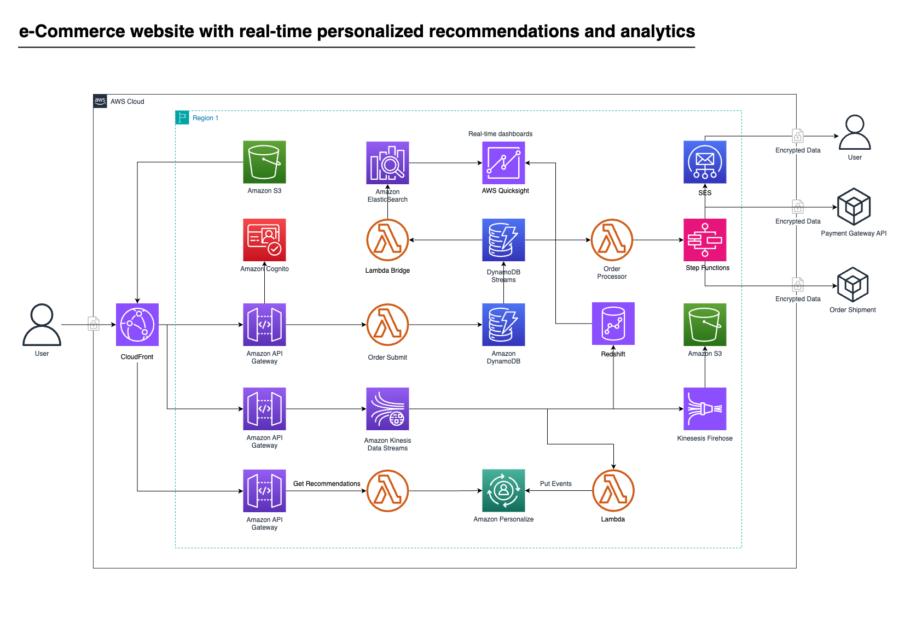

# E-commerce Website with the personalised recommendations and real-time analytics: AWS CDK



This project implements a scalable e-commerce analytics platform using AWS CDK. It processes clickstream data, handles order processing, and provides infrastructure for data analysis and personalization.

The platform leverages various AWS services to create a robust and scalable architecture for handling e-commerce data. It includes components for data ingestion, processing, storage, and analysis, enabling businesses to gain insights from customer interactions and optimize their e-commerce operations.


### Data Flow

1. Clickstream data is ingested into the Kinesis Data Stream.
2. The ClickstreamProcessor Lambda function processes the data from the Kinesis stream.
3. Processed data is sent to Amazon Personalize for event tracking and to Kinesis Firehose for storage.
4. Kinesis Firehose delivers the data to an S3 bucket for long-term storage and analysis.
5. Orders are processed by the OrderProcessing Lambda function.
6. Order data is stored in DynamoDB and indexed in OpenSearch for quick retrieval and search capabilities.

```
[Clickstream Data] -> [Kinesis Stream] -> [ClickstreamProcessor Lambda] -> [Personalize / Firehose]
                                                                        -> [S3 Bucket]
[Order Data] -> [API Gateway] -> [OrderProcessing Lambda] -> [DynamoDB / OpenSearch]
```

## Infrastructure

The infrastructure is defined using AWS CDK in TypeScript. Key resources include:

- S3:
  - WebsiteBucket: Stores static content for the e-commerce website
  - clickstreamBucket: Stores processed clickstream data

- Cognito:
  - UserPool: Manages user authentication and authorization

- DynamoDB:
  - OrdersTable: Stores order information

- Kinesis:
  - ClickstreamStream: Ingests real-time clickstream data

- Lambda:
  - ClickstreamProcessor: Processes clickstream data from Kinesis
  - OrderProcessing: Handles order processing and storage

- Firehose:
  - ClickstreamFirehose: Delivers clickstream data to S3

- CloudFront:
  - Distribution: Serves the static website content

- API Gateway:
  - EcommerceApi: Provides RESTful API for the e-commerce platform

- CloudWatch:
  - Alarms for monitoring Lambda function errors and throttles

The infrastructure is designed to be scalable and secure, with appropriate IAM roles and permissions set for each component.